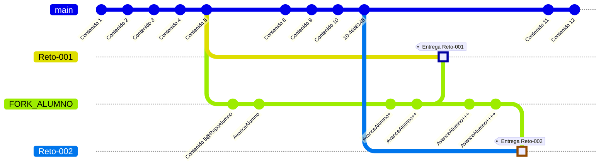

# Carpeta de entregas

- Nada fuera de esta carpeta
- Las subcarpetas deben seguir el estándar *apellidoNombre*
- Las entregas, a la rama del reto adecuado.

## Acerca de la entrega de los retos

La entrega correcta de los retos es parte de la evaluación de los mismos.

- Crear un fork del repositorio de la asignatura en su cuenta personal. 
- Dentro de su fork, crear su carpeta personal dentro de la carpeta de entrega.
- Para cada reto:
  - Crear la carpeta del reto
  - Trabajar el reto.
  - Una vez concluido, enviar un pull request (PR) al repositorio de la asignatura, asegurándose de hacerlo a la rama del reto correspondiente.

---

---

**Muy importante**: antes de enviar el Pull Request, hay que asegurarse de sincronizar los contenidos de su fork de modo que contengan la versión más actual de repositorio de la asignatura además del reto trabajado.