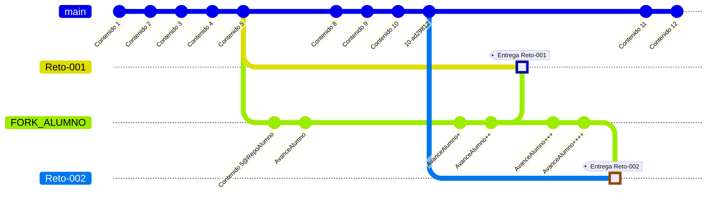

# Retos

Los retos se irán proponiendo, habitualmente luego de una disertación teórica. Cada uno tendrá sus reglas de resolución y serán de entrega individual, aunque se puede (y se anima) a trabajarlos en grupo.

|Reto|Salida por Consola|Variables|Entrada por Consola|Condicionales|Bucles|Tablas
|-|:-:|:-:|:-:|:-:|:-:|:-:|
[001 - Devolver cambio](001-DevolverCambio/README.md)|✅|✅|⬜|⬜|⬜|⬜
[002 - Devolver cambio extendido](002-DevolverCambio/README.md)|✅|✅|⬜|⬜|⬜|⬜

## Acerca de la entrega de los retos

La entrega correcta de los retos es parte de la evaluación de los mismos.

- Crear un fork del repositorio de la asignatura en su cuenta personal. 
- Dentro de su fork, crear su carpeta personal dentro de la carpeta de entrega.
- Para cada reto:
  - Crear la carpeta del reto
  - Trabajar el reto.
  - Una vez concluido, enviar un pull request (PR) al repositorio de la asignatura, asegurándose de hacerlo a la rama del reto correspondiente.

---

---

**Muy importante**: antes de enviar el Pull Request, hay que asegurarse de sincronizar los contenidos de su fork de modo que contengan la versión más actual de repositorio de la asignatura además del reto trabajado.