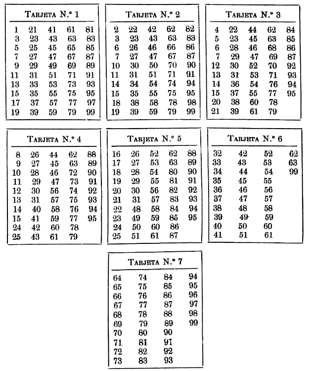

# Adivinación (o no...)

En las ferias solia haber magos que lograban *adivinar* el número que había pensado el usuario. El proceso consistía en ir mostrando una serie de nueve cartas, en las cuales habían números tal que así:

<div align=center>



</div>

Habiendo dicho el usuario las cartas que contenían el número pensado, la *labor* del mago consistía en sumar mentalmente el número que se encontraba en la parte superior izquierda.

Por ejemplo, si la persona había pensado el número 7, diría que las tarjetas eran la 1, la 2 y la 3, por tanto el mago sumaría 1 + 2 + 4, lo que, efectivamente, daba 7.

## Reto

Escriba un programa que utilice este algoritmo con las cartas mostradas arriba y que “adivine” el número que ha pensado el usuario.

### Sugerencia de presentación

```
C:\>java AdivinaNumero

Utilice 1 para SI, 0 para NO

Piense un número del 1 al 99

¿Está en la 1ra tarjeta? 1
¿Está en la 2da tarjeta? 0
(...)
¿Está en la 7ma tarjeta? 1

El número pensado es 72

C:\>
```

## Explicación matemática

<div align=center>


</div>
