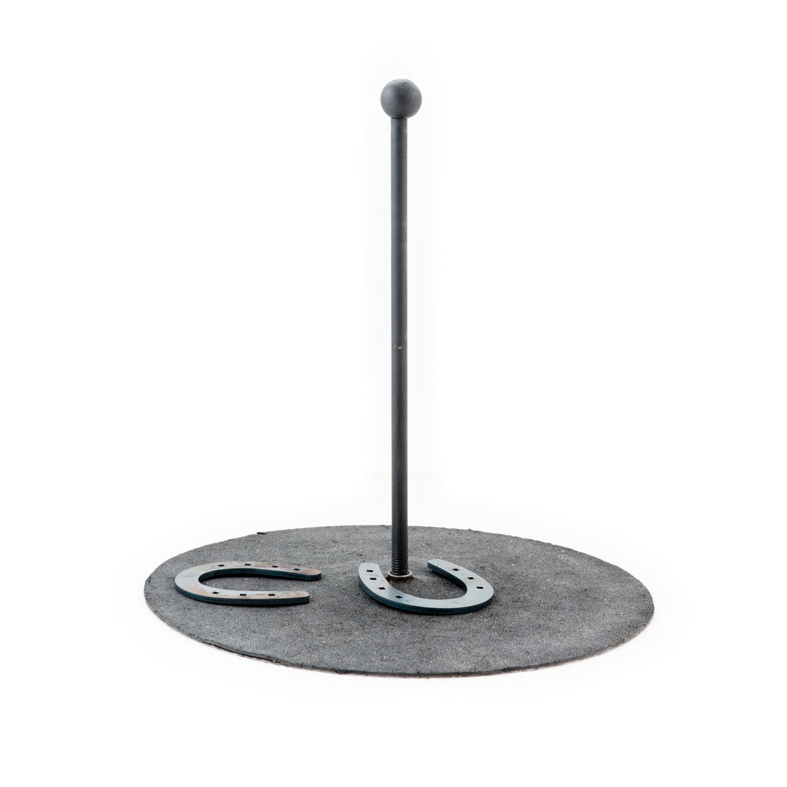

# El juego de la herradura

Naneh y Armand, del municipio de Peralejos de las Truchas, son muy aficionados al juego de la herradura. Así las cosas, cada día luego de su trabajo se enfrascan en una partida. Ambos tienen ya cierta habilidad adquirida con el juego: son capaces de lanzar y acertar con un alto grado de efectividad.

A continuación, se muestra la tabla que indica la probabilidad de caer en un tramo:

<div align=center>

|Tramo|Probabilidad de acierto|
|-|-|
Primer tramo (Muy cerca / Acierto)|10 %
Segundo tramo (Cerca)|12 %
Tercer tramo (Lejos)|78 %

</div>

De acuerdo a las reglas del juego de la herradura de la Sociedad de la Herradura de Peralejos de las Truchas, los jugadores, una vez situados en la línea de lanzamiento y según turno establecido previamente, lanzan las herraduras intentando que entren en la varilla o se aproximen a ella lo más posible. La partida dura hasta que uno de los jugadores llegue a 50 puntos. 

Los puntos se contabilizan de acuerdo al siguiente baremo:

|||
|-|-|
Acierto|5 puntos para el que acierte (tramo más cercano a la herradura)
Ganador|3 puntos para el jugador que más se acerque (tramo más cercano a la herradura).
En caso de empate|1 punto cada uno (en cualquier tramo)

## Reto

Desarrolle un programa que simule esta partida por tramos y nos diga, para cada ronda, cuál fue el resultado de los lanzamientos y cuál de los dos jugadores ganó dicha ronda.

## Sugerencia de presentación

```
>java juegoHerradura
 > Lanzamiento N.1: Naneh:[Tramo 3]  Armand:[Tramo 3]
 > Lanzamiento N.2: Naneh:[Tramo 3]  Armand:[Tramo 3]
 > Lanzamiento N.3: Naneh:[Tramo 2]  Armand:[Tramo 3]
 > Lanzamiento N.4: Naneh:[Tramo 3]  Armand:[Tramo 2]
                                     (...)
 > Lanzamiento N.34: Naneh:[Tramo 3]  Armand:[Tramo 3]
 > Lanzamiento N.35: Naneh:[Tramo 3]  Armand:[Tramo 2]
 > Lanzamiento N.36: Naneh:[Tramo 3]  Armand:[Tramo 3]
 > Lanzamiento N.37: Naneh:[Tramo 3]  Armand:[Tramo 2]
 > Lanzamiento N.38: Naneh:[Tramo 3]  Armand:[Tramo 3]
 > Lanzamiento N.39: Naneh:[Tramo 3]  Armand:[Tramo 3]
 > Lanzamiento N.40: Naneh:[Tramo 3]  Armand:[Tramo 1]
 > Lanzamiento N.41: Naneh:[Tramo 3]  Armand:[Tramo 2]
 > Lanzamiento N.42: Naneh:[Tramo 3]  Armand:[Tramo 3]
 > Lanzamiento N.43: Naneh:[Tramo 3]  Armand:[Tramo 1]
Puntos Naneh:52 Puntos Armand:49
```
