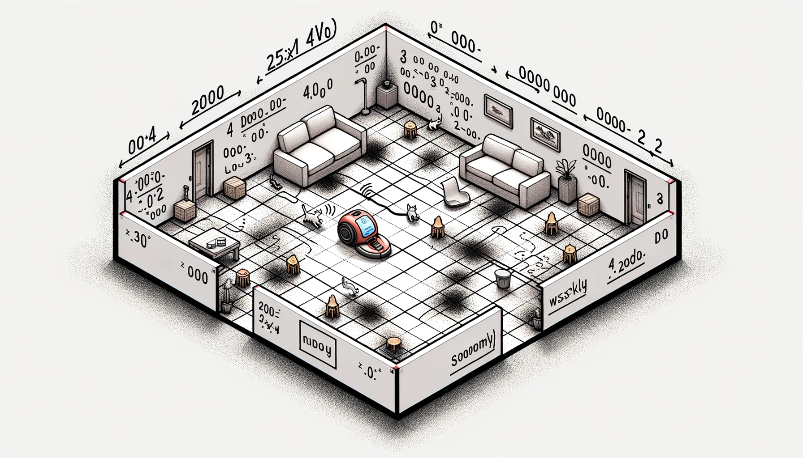

# Una aspiradora

Defina e implemente una manera de representar una superficie (por ejemplo, un rectángulo de 25x10), incluyendo zonas limpias y sucias.

Las zonas sucias pueden tener hasta 4 niveles de suciedad.

Hecho esto, implemente una aspiradora sobre la superficie y dótela de movimiento. El movimiento es aleatorio en las ocho direcciones, con la misma probabilidad en cada dirección. Asuma que el terreno no está exageradamente sucio, de modo que la aspiradora puede moverse libremente, y está limitada únicamente por las paredes de los bordes.

Agregue a la aspiradora la capacidad de limpiar la superficie, de modo que cuando pase sobre una zona sucia, esta pase a estar limpia. En las zonas de alto nivel de suciedad, la aspiradora reduce en uno el nivel de suciedad por cada pasada

<div align=center>

```
+---------------------------------------------------+
| ·  ·  ·  ·  ·  ·  ·  ·  ·  ·  ·  ·  ·  ·  ·  ·  · |
| ·  ·  ·  ·  ·  ·  · "^" ·  ·  ·  ·  ·  ·  ·  ·  · |
|OOO · ooo ·  ·  ·  ·  ·  · ooo ·  ·  ·  ·  · ...OOO|
|ooo ·  ·  ·  ·  ·  · ooo · +-------+ooo ·  ·  · ooo|
| ·  · ooo*** ·  ·  · ooo · |#######|ooo ·  ·  · ooo|
| ·  ·  ·  ·  ·  · ooo ·  · +-------+ooo ·  ·  · ooo|
| ·  ·  ·  ·  ·  ·  · ooo · ooo ·  ·  ·  ·  ·  · ooo|
| ·  · ooo · (O) ·  · *** · ooo ·  ·  ·  ·  ·  · ooo|
|ooo · ooo ·  ·  ·  · *** · ooo ·  ·  ·  ·  ·  · ooo|
|OOO · ooo ·  ·  ·  ·  ·  · ooo ·  ·  ·  ·  · ...OOO|
| ·  ·  ·  ·  ·  ·  ·  ·  ·  ·  ·  ·  ·  · ... ·  · |
|[####][####] ·  ·  ·  ·  ·  ·  ·  ·  · ... ·  ·  · |
| ·  ·  ·  ·  ·  ·  ·  ·  ·  ·  ·  ·  ·  · ... ·  · |
| ·  ·  ·  ·  ·  ·  ·  ·  ·  ·  ·  ·  ·  · ... ·  · |
+---------------------------------------------------+
```

|||
|-|-|
Zona limpia|` . `
Zona sucia|`...`
Zona más sucia|`ooo`
Zona muy sucia|`OOO`
Zona sucísima|`***`
Aspiradora|`(0)`
Gato|`"^"`
Sofá|`[####]`
Mesa|``

</div>

Tome nota de cuantos **pasos** va realizando la aspiradora, de modo que podamos saber cuántos pasos le toma terminar de limpiar.

Agregue a su sistema la capacidad de **detectar la suciedad total** que va quedando en el terreno, de modo que podamos saber cuánto falta por limpiar.

Implemente una **batería**, que brinde a la aspiradora de la capacidad de recorrer 5 veces la superficie. Haga que se consuma conforme la aspiradora se desplace, de modo que si se llega a cero, el proceso de aspirado se detenga.

Implemente una **bolsa de basura** que limite la capacidad de recoger basura de la aspiradora. Si la bolsa se llena, la aspiradora se detiene y hace falta vaciarla. 

**Coloque muebles** en la habitación. Los muebles, al igual que las paredes, no pueden atravesarse.

Cada cierto tiempo en la habitación puede aparecer un **gato**. Este camina 25 pasos de modo aleatorio y aumenta la suciedad de la zona sobre la que pasa. Luego de esto, el gato desaparece.

Implemente la capacidad de **guiar** a la aspiradora, por si vemos que está intentando limpiar en un sitio que ya está limpio, para conducirla a una zona que esté sucia. 

Implemente la capacidad de **percibir** la zona más sucia, de modo que la aspiradora pueda dirigir la limpieza en lugar de limpiar de modo aleatorio.
